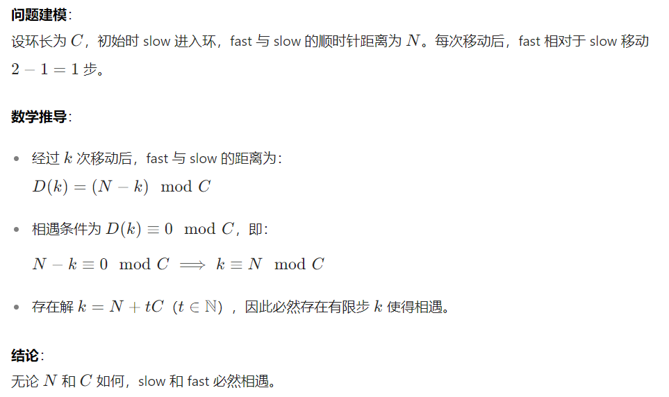
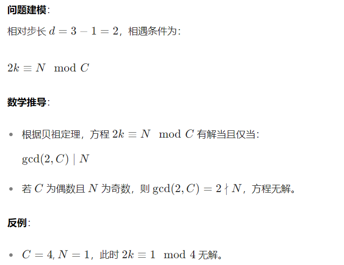
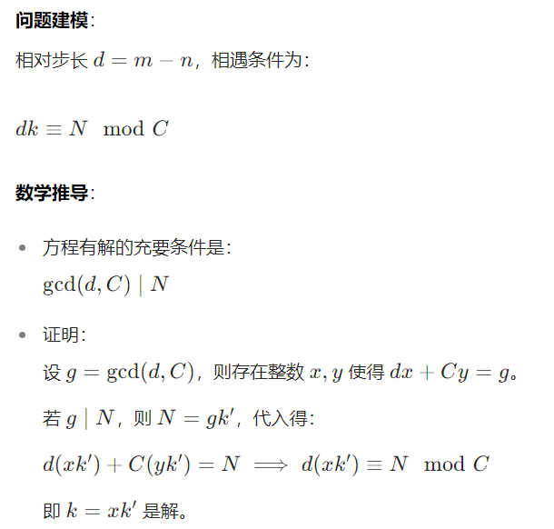
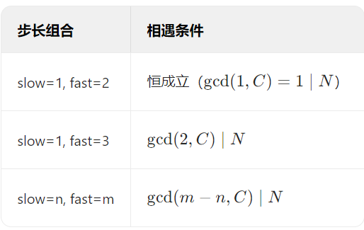

# 线性表经典算法

## 001、删除有序数组中的重复项（LeetCode 26）

### 思路
双指针法，`dst` 记录不重复元素位置，`src` 遍历数组。

### 代码实现
```c
int removeDuplicates(int* nums, int numsSize) 
{
    if (numsSize == 0) return 0;
    int dst = 1, src = 1;
    while (src < numsSize) 
    {
        if (nums[src] != nums[dst - 1]) 
        {
            nums[dst++] = nums[src];
        }
        src++;
    }
    return dst;
}
```

### 示例图

- 输入：`[0,0,1,1,1,2,2,3,3,4]`
- 输出：`dst` 之前存储的是不重复值的数组 `[0,1,2,3,4]`，返回长度 `5`。

### 做题反思

此算法利用双指针有效避免了额外的空间开销，时间复杂度为 O (n)。在处理有序数组去重问题时，双指针是一种常用且高效的方法。

## 002、合并两个有序数组（LeetCode 88）

### 思路

双指针比较，从后往前插入。

### 代码实现

```c
void merge(int* nums1, int m, int* nums2, int n) 
{
    int i = m - 1, j = n - 1, end = m + n - 1;
    while (i >= 0 && j >= 0) 
    {
        nums1[end--] = (nums1[i] > nums2[j]) ? nums1[i--] : nums2[j--];
    }
    while (j >= 0) 
    {
        nums1[end--] = nums2[j--];
    }
}
```

### 示例图

- `nums1: [1,2,3,0,0,0]`，`nums2: [2,5,6]`
- 合并后结果为 `[1,2,2,3,5,6]`。

### 做题反思

从后往前插入避免了数据的移动，时间复杂度为 O (m + n)。在处理合并有序数组问题时，利用数组的有序性和从后往前的插入方法可以提高效率。

## 003、链表的中间结点（LeetCode 876）
### 题目分析
给定单链表头结点 `head`，找出并返回链表的中间结点。若有两个中间结点，返回第二个中间结点。

### 解题思路
利用快慢指针：
- 慢指针 `slow` 一次移动一步，快指针 `fast` 一次移动两步。
- 当 `fast` 遍历完链表（`fast` 或 `fast->next` 为空），`slow` 正好指向中间结点。

### 代码实现
```c
struct ListNode* middleNode(struct ListNode* head) {
    struct ListNode* slow = head;
    struct ListNode* fast = head;
    while (fast && fast->next) {
        slow = slow->next;
        fast = fast->next->next;
    }
    return slow;
}
```

### 示例分析

- **输入**：`head = [1,2,3,4,5]`
- **输出**：包含值 `3` 的结点（中间结点）。
- **输入**：`head = [1,2,3,4,5,6]`
- **输出**：包含值 `4` 的结点（第二个中间结点）。

### 做题反思

快慢指针是链表问题的常用技巧，适用于找中间结点、判断环等场景。通过控制指针移动速度差，能高效解决链表遍历相关的定位问题。

## 004、移除链表元素（LeetCode 203）

### 题目分析

给定链表头结点 `head` 和整数 `val`，移除链表中所有值为 `val` 的节点，返回新的头结点。

### 解题思路

- 双指针法：使用 `prev`（前驱结点）和 `cur`（当前结点）遍历链表。
- 若 `cur` 指向的值为 `val`，则通过 `prev->next = cur->next` 移除 `cur` 结点。
- 处理头结点可能被删除的情况，可引入虚拟头结点简化逻辑，或单独判断头结点。

### 代码实现（双指针法）

```c
struct ListNode* removeElements(struct ListNode* head, int val) {
    struct ListNode* dummy = (struct ListNode*)malloc(sizeof(struct ListNode));
    dummy->next = head;
    struct ListNode* prev = dummy;
    struct ListNode* cur = head;
    
    while (cur) {
        if (cur->val == val) {
            prev->next = cur->next;
            free(cur);
            cur = prev->next;
        } else {
            prev = cur;
            cur = cur->next;
        }
    }
    head = dummy->next;
    free(dummy);
    return head;
}
```

### 示例分析

- **输入**：`head = [1,2,6,3,4,5,6]`, `val = 6`
- **输出**：`[1,2,3,4,5]`，所有值为 `6` 的结点被移除。

### 做题反思

- 处理链表删除问题时，虚拟头结点可统一头结点和普通结点的删除逻辑，避免单独判断头结点。
- 注意内存释放，删除结点后需及时 `free` 内存，防止内存泄漏。
- 双指针遍历是链表修改的核心方法，通过维护前驱结点，能灵活处理结点的删除操作。

## 005、反转链表（LeetCode 206）

### 题目分析

给定单链表的头节点 `head`，反转链表并返回反转后的头节点。

### 解题思路

**方法一：三指针法**

- 使用三个指针 `n1`（前一个节点）、`n2`（当前节点）、`n3`（后一个节点）。
- 初始时 `n1` 指向 `NULL`，`n2` 指向头节点，`n3` 指向头节点的下一个节点。
- 遍历链表，将当前节点 `n2` 的 `next` 指向前一个节点 `n1`，逐步后移指针。

**方法二：头插法**

- 创建新链表头节点 `newhead`。
- 遍历原链表，将每个节点插入到 `newhead` 的前面，实现反转。

### 代码实现

**双指针法**

```c
struct ListNode* reverseList(struct ListNode* head) 
{
    if (head == NULL) return NULL;
    struct ListNode *n1 = NULL, *n2 = head, *n3 = head->next;
    while (n2) 
    {
        n2->next = n1;
        n1 = n2;
        n2 = n3;
        if (n3) n3 = n3->next;
    }
    return n1;
}
```

**头插法**

```c
struct ListNode* reverseList(struct ListNode* head) {
    struct ListNode *cur = head, *newhead = NULL;
    while (cur) {
        struct ListNode *next = cur->next;
        cur->next = newhead;
        newhead = cur;
        cur = next;
    }
    return newhead;
}
```

### 示例分析

- **输入**：`head = [1,2,3,4,5]`
- **输出**：`[5,4,3,2,1]`

### 做题反思

- 双指针法通过维护前驱和后继节点实现反转，时间复杂度 O (n)，空间复杂度 O (1)。
- 头插法通过构建新链表简化逻辑，时间复杂度 O (n)，空间复杂度 O (1)。
- 链表反转是链表操作的基础，常用于复杂链表问题（如反转部分链表）。

## 006、链表中倒数第 k 个结点

### 题目分析

输入一个链表，输出该链表中倒数第 k 个结点。若 k 超过链表长度，返回`NULL`。

### 解题思路

**双指针法**

- 快慢指针 `slow` 和 `fast` 初始均指向头节点。
- `fast` 先移动 `k` 步，若期间 `fast` 为空，返回 `NULL`。
- 快慢指针同步移动，直到 `fast` 到达末尾，此时 `slow` 指向倒数第 k 个节点。

### 代码实现

```c
struct ListNode* FindKthToTail(struct ListNode* pListHead, int k) 
{
    struct ListNode *slow = pListHead, *fast = pListHead;
    while (k--) 
    {
        if (fast == NULL) return NULL;
        fast = fast->next;
    }
    
    while (fast) 
    {
        slow = slow->next;
        fast = fast->next;
    }
    
    return slow;
}
```

### 示例分析

- **输入**：`head = [1,2,3,4,5], k = 2`
- **输出**：包含值 `4` 的节点

### 做题反思

- 双指针法通过控制指针移动步差，避免两次遍历链表，时间复杂度 O (n)。
- 需处理边界条件（如 `k=0` 或链表为空），确保代码鲁棒性。

## 007、环形链表（LeetCode 141）

### 题目分析

判断链表中是否存在环。若存在环，返回`true`，否则返回`false`。

### 解题思路

**快慢指针法**

- 慢指针 `slow` 每次移动一步，快指针 `fast` 每次移动两步。
- 若链表有环，快慢指针会在环内相遇；若无环，`fast` 会先到达链表末尾。

### 代码实现

```c
bool hasCycle(struct ListNode* head) {
    struct ListNode *slow = head, *fast = head;
    while (fast && fast->next) {
        slow = slow->next;
        fast = fast->next->next;
        if (slow == fast) return true;
    }
    return false;
}
```

### 示例分析

- **输入**：`head = [3,2,0,-4], pos = 1`（环指向第二个节点）
- **输出**：`true`

### 做题反思

- 快慢指针法是检测链表环的经典方法，时间复杂度 O (n)，空间复杂度 O (1)。
- 数学证明：若链表有环，快慢指针必然相遇。假设环长为 C，初始距离为 N，每次追击距离缩小 1，最终必相遇。
- 若需找到环的入口，可结合相遇点与头节点同步移动的方法。

### **拓展思路**

#### 1. slow 走 1 步，fast 走 2 步



#### 2. slow 走 1 步，fast 走 3 步



#### 3. slow 走 n 步，fast 走 m 步（m>n>1）



#### 总结



## 012、环形链表 II（LeetCode 142）

### 题目分析

给定一个链表，判断链表是否有环，若有环则返回链表开始入环的第一个节点；若链表无环，返回 `NULL`。要求以线性时间复杂度（O (n)）和常数空间复杂度（O (1)）解决。

### 解题思路

1. 快慢指针找相遇点：
   - 定义慢指针 `slow`（每次走 1 步）和快指针 `fast`（每次走 2 步）。
   - 若链表有环，两者最终会在环内相遇。
2. 找入环口：
   - 设头节点到入环口需走 `a` 步，环长为 `c`。相遇时，慢指针走了 `b` 步，快指针走了 `2b` 步。
   - 快指针比慢指针多走 `k` 圈环，即 `2b - b = kc`，得 `b = kc`。
   - 慢指针从入环口到相遇点走了 `b - a = kc - a` 步，说明从相遇点再走 `a` 步可达入环口。
   - 让头节点和慢指针同时移动，经过 `a` 步后，两者相遇处即为入环口。

### 代码实现

```c
struct ListNode* detectCycle(struct ListNode* head) 
{  
    struct ListNode* slow = head;  
    struct ListNode* fast = head;  
    while (fast && fast->next) {  
        slow = slow->next;  
        fast = fast->next->next;  
        if (fast == slow) { // 相遇  
            while (slow != head) { // 再走 a 步  
                slow = slow->next;  
                head = head->next;  
            }  
            return slow;  
        }  
    }  
    return NULL;  
}  
```


### 复杂度分析

- **时间复杂度**：O (n)，其中 `n` 为链表长度。快慢指针遍历链表和后续找入环口的操作均为线性时间。
- **空间复杂度**：O (1)，仅使用常数级额外变量，未占用额外线性空间。

## 008、合并两个有序链表（LeetCode 21）

### 题目分析

将两个升序链表合并为一个新的升序链表并返回。新链表由两个链表的所有节点组成。

### 解题思路

#### 方法一：双指针法（虚拟头节点）

1. **虚拟头节点**：创建虚拟头节点简化头节点操作
2. **双指针遍历**：维护`tail`指针指向当前合并链表的末尾
3. **比较合并**：每次选择较小节点追加到`tail`后
4. **处理剩余**：拼接剩余未遍历完的链表

#### 方法二：哨兵位单链表法

1. **哨兵位头节点**：使用带哨兵位的头节点统一处理边界条件
2. **尾插法**：通过`tail`指针直接操作节点
3. **剩余节点处理**：直接拼接剩余链表

### 代码实现

#### 方法一：虚拟头节点

```c
struct ListNode* mergeTwoLists(struct ListNode* list1, struct ListNode* list2) {
    struct ListNode dummy = {0};
    struct ListNode* tail = &dummy;
    
    while (list1 && list2) {
        if (list1->val < list2->val) {
            tail->next = list1;
            list1 = list1->next;
        } else {
            tail->next = list2;
            list2 = list2->next;
        }
        tail = tail->next;
    }
    
    tail->next = list1 ? list1 : list2;
    return dummy.next;
}
```

#### 方法二：哨兵位单链表

```c
struct ListNode* mergeTwoLists(struct ListNode* list1, struct ListNode* list2) {
    struct ListNode dummy; // 哨兵位头节点
    struct ListNode* tail = &dummy;
    
    while (list1 && list2) {
        if (list1->val < list2->val) {
            tail->next = list1;
            list1 = list1->next;
        } else {
            tail->next = list2;
            list2 = list2->next;
        }
        tail = tail->next;
    }
    
    tail->next = list1 ? list1 : list2;
    return dummy.next;
}
```

### 示例分析

- **输入**：`list1 = [1,2,4]`, `list2 = [1,3,4]`
- **输出**：`[1,1,2,3,4,4]`
- 过程说明：
  1. 初始`tail`指向虚拟头节点
  2. 比较`1`和`1`，选择任意一个（此处选`list1`）
  3. 依次比较剩余节点，最终合并完成

### 做题反思

#### 方法对比

| 特性       | 虚拟头节点法             | 哨兵位单链表法         |
| ---------- | ------------------------ | ---------------------- |
| 头节点处理 | 需要虚拟头节点           | 哨兵位统一处理         |
| 代码行数   | 较多（需初始化虚拟节点） | 较少（直接使用哨兵位） |
| 可读性     | 稍差                     | 更直观                 |
| 内存开销   | 无（虚拟节点在栈上）     | 无（哨兵节点在栈上）   |

#### 关键优化点

1. **尾指针优化**：避免每次遍历链表找尾节点，时间复杂度从 O (n²) 降为 O (n)
2. 哨兵位优势：
   - 消除头节点为空的边界判断
   - 统一处理头节点和普通节点
3. **原地合并**：无需额外空间，空间复杂度 O (1)

#### 拓展思考

- 递归解法：

  ```c
  struct ListNode* mergeTwoLists(struct ListNode* list1, struct ListNode* list2) {
      if (!list1) return list2;
      if (!list2) return list1;
      if (list1->val < list2->val) {
          list1->next = mergeTwoLists(list1->next, list2);
          return list1;
      } else {
          list2->next = mergeTwoLists(list1, list2->next);
          return list2;
      }
  }
  ```

  - 时间复杂度：O (m+n)
  - 空间复杂度：O (m+n)（递归栈深度）

### 复杂度分析

| 方法     | 时间复杂度 | 空间复杂度 |
| -------- | ---------- | ---------- |
| 双指针法 | O(m+n)     | O(1)       |
| 递归法   | O(m+n)     | O(m+n)     |

### 关键点总结

1. **核心思想**：通过双指针选择较小节点逐步合并
2. 优化技巧：
   - 虚拟头节点 / 哨兵位简化操作
   - 尾指针避免重复遍历
3. 边界处理：
   - 空链表直接返回另一个链表
   - 剩余节点直接拼接

## 009、链表的回文结构（OR36）

### 题目分析

判断链表是否为回文结构，要求时间复杂度 O (n)，空间复杂度 O (1)

### 解题思路

**快慢指针 + 链表反转**：

1. 快慢指针找到中间节点
2. 反转后半部分链表
3. 双指针比较前后两部分

### 代码实现

```c
bool chkPalindrome(struct ListNode* head) 
{
    // 找中间节点
    struct ListNode *slow = head, *fast = head;
    while (fast && fast->next) 
    {
        slow = slow->next;
        fast = fast->next->next;
    }
    
    // 反转后半段
    struct ListNode *cur = slow, *newHead = NULL;
    while (cur) {
        struct ListNode *next = cur->next;
        cur->next = newHead;
        newHead = cur;
        cur = next;
    }
    
    // 比较前后两部分
    while (head && newHead) {
        if (head->val != newHead->val) return false;
        head = head->next;
        newHead = newHead->next;
    }
    return true;
}
```

### 示例分析

- **输入**：`head = [1,2,2,1]`
- **输出**：`true`

### 做题反思

- 快慢指针法时间复杂度 O (n)
- 链表反转操作需注意指针顺序
- 奇数长度链表处理：中间节点属于前半段
- 需恢复链表结构（若有需要）

## 010、复制带随机指针的链表（LeetCode 138）

### 题目分析

复制一个带有随机指针的链表，要求深拷贝（新链表与原链表完全独立）

### 解题思路

**三步法**：

1. **复制节点**：在原节点后插入复制节点
2. **处理随机指针**：复制节点的随机指针指向原节点随机指针的下一个节点
3. **拆分链表**：分离原链表和复制链表

### 代码实现

```c
/**
 * Definition for a Node.
 * struct Node {
 *     int val;
 *     struct Node *next;
 *     struct Node *random;
 * };
 */

struct Node* copyRandomList(struct Node* head) 
{
    // 第一步：复制节点插入原链表（每个原节点后插入复制节点）
    struct Node* Cur = head;
    while(Cur)
    {
        struct Node* Copy = (struct Node*)malloc(sizeof(struct Node));
        Copy->val = Cur->val;
        Copy->random = NULL; // 显式初始化 random 指针
        Copy->next = Cur->next;
        Cur->next = Copy;
        Cur = Copy->next;
    }	
    
    // 第二步：处理复制节点的 random 指针
    Cur = head;
    while(Cur)
    {
        if(Cur->random)
        {
            Cur->next->random = Cur->random->next; // 复制节点的 random 指向原节点 random 指向节点的复制节点
        }
        Cur = Cur->next->next;
    }

    // 第三步：拆分原链表与复制链表，构建独立新链表
    Cur = head;
    struct Node* Newhead = NULL; // 新链表头
    struct Node* Tail = NULL;    // 新链表尾
    while(Cur)
    {
        struct Node* copy = Cur->next; // 提取原节点后的复制节点
        struct Node* next = copy->next; // 记录原链表的下一个节点，用于原链表遍历推进
        
        // 尾插法构建新链表
        if(Newhead == NULL) // 处理新链表为空的情况，初始化头和尾
        {
            Newhead = Tail = copy;
        }
        else
        {
            Tail->next = copy; // 尾节点连接当前复制节点
            Tail = Tail->next; // 尾指针后移
        }
        
        Cur->next = next; // 恢复原链表的 next 指针，保证原链表连接正确
        Cur = next; // 推进原链表遍历
    }
    return Newhead; // 返回独立的复制链表头
}
```

### 示例分析

- **输入**：`head = [[7,null],[13,0],[11,4],[10,2],[1,0]]`
- **输出**：复制后的链表结构相同

### 做题反思

- 时间复杂度 O (n)，空间复杂度 O (1)
- 巧妙利用原链表结构避免哈希表
- 需注意内存管理，防止内存泄漏
- 随机指针处理依赖原链表结构


## 011、相交链表（LeetCode 160）

### 题目分析

给定两个单链表的头节点 `headA` 和 `headB`，判断两个链表是否相交。若相交，返回它们的第一个交点；若不相交，返回`NULL`。要求时间复杂度为 O (N)，空间复杂度为 O (1)。

### 解题思路

#### 方法一：暴力求解

1. **遍历链表 A**：依次取链表 A 的每个节点。
2. **遍历链表 B**：检查该节点是否存在于链表 B 中。
3. **时间复杂度**：O (N²)，效率较低。

#### 方法二：双指针优化法

1. 尾节点判断：
   - 分别遍历链表 A 和 B，记录尾节点和长度。
   - 若尾节点地址不同，直接返回`NULL`（不相交）。
2. 长度对齐：
   - 计算两链表长度差`n`。
   - 让较长链表的头指针先走`n`步。
3. 同步遍历：
   - 两链表头指针同步移动，第一个相同节点即为交点。

### 代码实现

```c
struct ListNode* getIntersectionNode(struct ListNode* headA, struct ListNode* headB) {
    // 找尾节点并计算长度
    struct ListNode *curA = headA, *curB = headB;
    int lenA = 1, lenB = 1;
    
    while (curA->next) {
        lenA++;
        curA = curA->next;
    }
    while (curB->next) {
        lenB++;
        curB = curB->next;
    }
    
    // 尾节点不同则不相交
    if (curA != curB) return NULL;
    
    // 长度对齐
    int gap = abs(lenA - lenB);
    struct ListNode *longList = (lenA > lenB) ? headA : headB;
    struct ListNode *shortList = (lenA > lenB) ? headB : headA;
    
    while (gap--) {
        longList = longList->next;
    }
    
    // 同步遍历找交点
    while (longList != shortList) {
        longList = longList->next;
        shortList = shortList->next;
    }
    return longList;
}
```

### 示例分析

- 输入：
  - 链表 A：`[4,1,8,4,5]`
  - 链表 B：`[5,0,1,8,4,5]`
- **输出**：交点节点值为`8`
- 过程说明：
  1. 尾节点均为`5`，确定相交。
  2. 链表 A 长度为 5，链表 B 长度为 6，gap=1。
  3. 链表 B 头指针先走 1 步到节点`0`，同步移动后在节点`8`相遇。

### 做题反思

1. **尾节点验证**：通过尾节点地址判断相交，避免复杂逻辑。
2. 双指针优化：
   - 长度对齐后同步遍历，确保时间复杂度 O (N)。
   - 无需额外空间，空间复杂度 O (1)。
3. 边界处理：
   - 空链表直接返回`NULL`。
   - 处理长度差时需取绝对值。
4. **拓展思考**：若允许修改链表结构，可通过标记节点或反转链表简化问题。


## 012、用队列实现栈（LeetCode 225）

## 013、用栈实现队列（LeetCode 232）

***


## 刷题模板

### 顺序表刷题模板

```c
// 动态顺序表结构定义
typedef struct SeqList 
{
    int* array;    // 动态数组指针
    size_t size;   // 有效数据个数
    size_t capacity; // 容量
} SeqList;

// 初始化顺序表
void SeqListInit(SeqList* ps) {
    ps->array = NULL;
    ps->size = 0;
    ps->capacity = 0;
}

// 插入元素
void SeqListPushBack(SeqList* ps, int x) {
    // 检查容量
    if (ps->size == ps->capacity) {
        // 扩容操作
    }
    ps->array[ps->size++] = x;
}

// 删除元素
void SeqListPopBack(SeqList* ps) {
    if (ps->size > 0) {
        ps->size--;
    }
}

// 访问元素
int SeqListGet(SeqList* ps, int index) {
    if (index >= 0 && index < ps->size) {
        return ps->array[index];
    }
    return -1; // 错误处理
}

// 释放顺序表
void SeqListDestroy(SeqList* ps) {
    free(ps->array);
    ps->array = NULL;
    ps->size = 0;
    ps->capacity = 0;
}
```

### 单链表刷题模板

```c
// 单链表节点结构定义
struct ListNode 
{
    int val;
    struct ListNode* next;
    ListNode(int x) : val(x), next(NULL) {}
};

// 尾插操作
void SLTPushBack(ListNode** pphead, int x) 
{
    ListNode* newnode = new ListNode(x);
    if (*pphead == NULL) 
    {
        *pphead = newnode;
    } else 
    {
        ListNode* tail = *pphead;
        while (tail->next != NULL) 
        {
            tail = tail->next;
        }
        tail->next = newnode;
    }
}

// 打印链表
void SLTPrint(ListNode* phead) 
{
    ListNode* cur = phead;
    while (cur != NULL) 
    {
        printf("%d ", cur->val);
        cur = cur->next;
    }
    printf("\n");
}

// 头插操作
void SLTPushFront(ListNode** pphead, int x) 
{
    ListNode* newnode = new ListNode(x);
    newnode->next = *pphead;
    *pphead = newnode;
}

// 头删操作
void SLTPopFront(ListNode** pphead) 
{
    if (*pphead == NULL) return;
    ListNode* next = (*pphead)->next;
    delete *pphead;
    *pphead = next;
}

// 尾删操作
void SLTPopBack(ListNode** pphead) 
{
    if (*pphead == NULL) return;
    if ((*pphead)->next == NULL) 
    {
        delete *pphead;
        *pphead = NULL;
    } else {
        ListNode* prev = NULL;
        ListNode* tail = *pphead;
        while (tail->next != NULL) 
        {
            prev = tail;
            tail = tail->next;
        }
        delete tail;
        prev->next = NULL;
    }
}
```